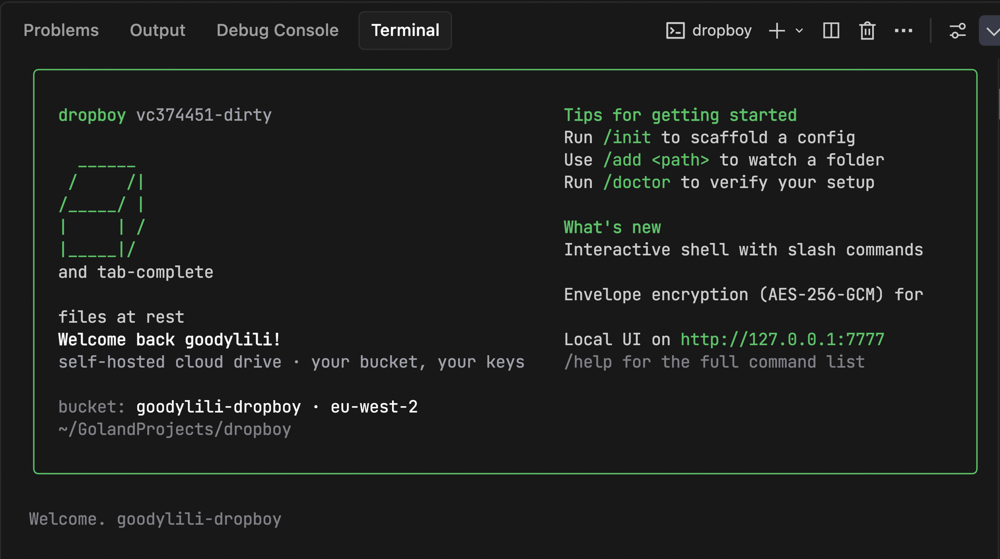

# dropboy



Self-hosted cloud drive on top of your own AWS S3 bucket. iCloud Drive for
people who'd rather hold their own keys.

- Continuous two-way sync between local folders and S3
- Client-side AES-256-GCM encryption (your passphrase, your keys)
- Local web UI + CLI; daemon runs under launchd
- macOS only at the moment (Apple Silicon + Intel via universal binary)

## Install

### Homebrew (recommended)

```sh
brew tap goodylili/tap
brew install dropboy
```

### From source

```sh
git clone https://github.com/goodylili/dropboy
cd dropboy
make release-build      # builds the frontend + embeds + builds the binary
make install            # /usr/local/bin/dropboy (or ~/.local/bin)
```

Requires Go 1.25+ and Node.js 20+.

## Quick start

```sh
dropboy init            # walks you through bucket, region, passphrase, folders
dropboy start           # installs and starts the launchd service
dropboy ui --open       # opens the local web UI in your browser
dropboy status          # tldr: queue depth, last sync, conflicts
```

See `config.example.yaml` for the on-disk format. The file lives at
`~/.dropboy/config.yaml`.

## Security model

- Files are encrypted **before** upload with a per-object AES-256-GCM key.
  The data encryption key is wrapped with a master key derived from your
  passphrase; only ciphertext, nonces, and the wrapped key leave the machine.
- The loopback HTTP API on `127.0.0.1:7777` is protected by a per-session
  token at `~/.dropboy/ui.token` (mode `0600`), CSRF header, host-header
  rebinding guard, and security headers (CSP, X-Frame-Options, etc.).
- Passphrase entries can be cached in the macOS Keychain
  (`service=com.dropboy`); use `dropboy ui` → *Forget passphrase* to clear.
- The `/api/v1/unlock` and `/api/v1/forget-passphrase` endpoints are
  per-source rate-limited.

## Common commands

| Command | What it does |
|---|---|
| `dropboy init` | Generate a fresh config interactively |
| `dropboy add <path>` | Add a folder to sync |
| `dropboy remove <path>` | Stop syncing a folder |
| `dropboy list` | Show synced folders |
| `dropboy start` / `stop` / `restart` | Manage the launchd service |
| `dropboy sync` | Force one reconciliation pass now |
| `dropboy pause` / `resume` | Hold / resume background sync |
| `dropboy status` | Daemon health, queue, last sync time |
| `dropboy conflicts` | List unresolved conflicts |
| `dropboy restore <path>` | Pull the latest remote copy of a file |
| `dropboy logs -f` | Tail `~/Library/Logs/dropboy/dropboy.log` |
| `dropboy doctor` | Diagnose config / AWS / keychain issues |
| `dropboy uninstall` | Remove the service file |

## AWS setup

1. Create an S3 bucket.
2. Enable bucket versioning (so dropboy can offer point-in-time restore).
3. Enable default SSE-S3 or SSE-KMS encryption (defence in depth — dropboy
   encrypts client-side as well).
4. Create an IAM user/role with `s3:GetObject`, `s3:PutObject`,
   `s3:DeleteObject`, `s3:ListBucket`, `s3:GetObjectVersion`, and
   `s3:ListBucketVersions` on the bucket and its objects.
5. Add credentials via the AWS shared config (`~/.aws/credentials`) or
   `AWS_*` environment variables. `aws_profile` in the dropboy config picks
   which profile to use.

## Configuration

See [`config.example.yaml`](config.example.yaml). Notable fields:

- `limits.max_upload_mbps` throttles upload bandwidth (0 = unlimited).
- `limits.delete_grace_hours` is the tombstone window — a missing local
  file isn't deleted from S3 until this many hours have passed.
- `poll.remote_seconds` / `poll.full_scan_minutes` control polling cadence.
- `ui.port` sets the loopback port for the web UI (default 7777).

## Troubleshooting

- **`dropboy status` says locked.** Run `dropboy ui` and enter your
  passphrase, or `dropboy start --foreground` with
  `DROPBOY_PASSPHRASE=...` set.
- **Conflicts piling up.** `dropboy conflicts` lists them; resolve in the
  UI (Keep local / Keep remote / Keep both).
- **Service won't stay running.** Tail
  `~/Library/Logs/dropboy/dropboy.log`. Common cause: AWS credentials
  expired or the profile in `~/.dropboy/config.yaml` is wrong.
- **Reset everything.** `dropboy uninstall && rm -rf ~/.dropboy` — note
  this clears local state, not the bucket.

## Development

```sh
make frontend-dev          # Next.js dev server on :3000 with API proxy
make build-go              # Go binary only (no UI rebake)
make test                  # go test ./...
make release-build         # the same path the release pipeline takes
```

The frontend lives in `frontend/`; see `frontend/AGENTS.md` for Next 16
conventions. The Go daemon serves the embedded UI in production
(`backend/internal/server/spa.go`).

## Release process

1. Bump the entry in `CHANGELOG.md`.
2. `git tag v0.1.0 && git push --tags`.
3. The `release` workflow runs goreleaser on macos-latest: builds the
   universal binary, archives it, publishes the GitHub release, and pushes
   an updated formula to `goodylili/homebrew-tap` (uses the
   `HOMEBREW_TAP_TOKEN` repo secret — a PAT with `repo` scope on the tap).

The tap repo just needs an empty `Formula/` directory on `main`; goreleaser
creates `Formula/dropboy.rb` on each release.

Apple Developer ID signing is wired up but commented out in
`backend/.goreleaser.yaml` — enable it once you have a Developer Program
membership. Unsigned binaries still run after one Gatekeeper override.

## License

MIT — see [`LICENSE`](LICENSE).
